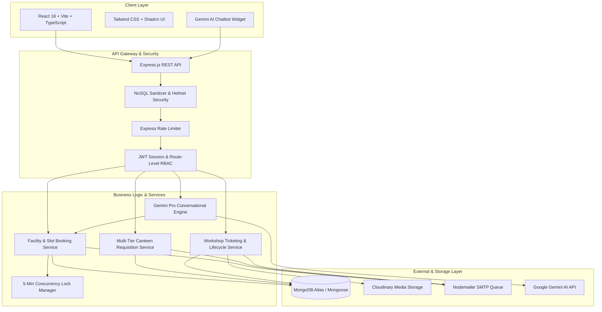
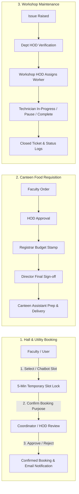

# BookMyHall — College Management & Multi-Tenant Facility Booking ERP

**BookMyHall** is an enterprise-grade, multi-tenant monorepo application designed for colleges and universities to manage campus resources, seminar hall bookings, canteen food requisitions, and workshop infrastructure maintenance. It features automated multi-tier approval workflows, strict Role-Based Access Control (RBAC), temporary concurrency slot locking, and an integrated **Google Gemini AI Chatbot** for conversational slot booking.

---

## 🏛️ System Architecture



---

## 🔄 Core Workflow Pipelines



---

## 🛠️ Tech Stack

### Frontend
* **Core Framework**: React 18, TypeScript, Vite
* **Styling & UI**: Tailwind CSS, Shadcn UI Components, Lucide Icons, Radix UI Primitives
* **Data Fetching & State**: TanStack React Query, Axios, Custom Caching Layer
* **Charts & Visualizations**: Recharts
* **SEO & Metadata**: Dynamic OpenGraph, Canonical URLs, Schema.org Structured Data

### Backend
* **Runtime & Framework**: Node.js, Express.js (ES Modules)
* **Database & ODM**: MongoDB, Mongoose
* **AI & Natural Language**: Google Gemini Pro API (`@google/genai`)
* **Security & Auth**: JSON Web Tokens (JWT), BCrypt.js, Helmet, Express Rate-Limit, Mongo Sanitize
* **Email & Notifications**: Nodemailer (asynchronous queues for workflow transitions)
* **File Uploads**: Cloudinary & Multer

---

## ✨ Key Features & Modules

### 1. Seminar Hall & Resource Booking
* **5-Minute Slot Lock**: Prevents race conditions and double-booking by temporarily reserving slots while users complete confirmation.
* **Gemini Conversational Booking**: Natural language chatbot capable of finding open slots, answering facility FAQs, and locking slots directly in dialogue.
* **Auto-Release Mechanism**: Instantly frees held slots upon cancellation or lock expiration.

### 2. Multi-Tier Canteen Requisitions
* **Sequential Approval Chain**: `Faculty` $\to$ `HOD` $\to$ `Registrar (Budget Check)` $\to$ `Director (Sign-off)` $\to$ `Canteen Assistant Fulfillment`.
* **Live Order Tracking**: Preparation status, delivery personnel assignment, and billing records.

### 3. Maintenance & Workshop Ticketing Pipeline
* **End-to-End Resolution**: Categorized ticket creation with image attachment, HOD review, technician dispatch, progress updates, and resolution sign-offs.
* **Pause & Reopen Capability**: Workers can pause tickets with mandatory blocker reasons; requesters can unpause with resolution feedback.

### 4. Multi-Tenant Architecture
* Support for multiple organizations/institutions with isolated user registries, custom facility categories, and dedicated admin controls.

---

## 👥 Role-Based Access Control (RBAC) & Demo Logins

All demo accounts use the default password: **`123456`** (accessible directly from the dropdown on the login page).

| Role | Demo Email | Access Scope & Capabilities |
| :--- | :--- | :--- |
| **Super Admin** | `test.superadmin@test.local` | Platform administration, organization creation, system metrics |
| **Org Admin** | `test.admin@test.local` | College administration, user management, facility controls |
| **Director** | `test.director@test.local` | Executive approvals for canteen requisitions & institutional events |
| **Registrar** | `test.registrar@test.local` | Budget validation & administrative stamping |
| **Head of Department (HOD)** | `test.hod@test.local` | Departmental approvals for bookings, food requests & repairs |
| **Coordinator / Hall Manager** | `test.coord@test.local` | Facility slot reviews, conflict resolution & calendar management |
| **Faculty (Requester)** | `faculty.new@test.local` | Hall/lab booking, canteen requisition submission, repair ticketing |
| **Canteen Assistant** | `test.assistant@test.local` | Canteen department food orders, requisitions & delivery support |
| **Workshop HOD** | `test.workshophod@test.local` | Maintenance workload review & technician job assignment |
| **Technician Worker** | `test.worker@test.local` | Repair task execution, ticket pause/resume & job completion |
| **Canteen Owner** | `test.canteenowner@test.local` | Canteen management, food orders, menus & fulfillment |

---

## 🚀 Quick Start & Installation

### Prerequisites
* **Node.js** (v18.x or higher)
* **MongoDB** (Local instance or MongoDB Atlas cluster)
* **npm** or **pnpm** / **yarn**

---

### 1. Clone & Configure Repository

```bash
git clone https://github.com/samadhanmane/BookMyHall.git
cd BookMyHall
```

---

### 2. Backend Setup

```bash
cd backend

# Copy sample environment configuration
cp .env.example .env

# Install dependencies
npm install

# Run in development mode (with hot-reload)
npm run dev
```
> The API will start on **`http://localhost:4000`**

---

### 3. Frontend Setup

```bash
cd ../frontend

# Copy sample environment configuration
cp .env.example .env

# Install dependencies
npm install

# Start Vite development server
npm run dev
```
> The web application will run on **`http://localhost:5173`**

---

## ⚙️ Environment Variables Overview

### Backend (`backend/.env`)
| Variable | Description | Example |
| :--- | :--- | :--- |
| `PORT` | API Server Port | `4000` |
| `MONGODB_URI` | MongoDB Connection String | `mongodb+srv://...` |
| `JWT_SECRET` | JWT Signing Key | `your_secret_key` |
| `GEMINI_API_KEY` | Google Gemini API Key | `AIzaSy...` |
| `SMTP_HOST` | SMTP Server Host | `smtp.gmail.com` |
| `SMTP_PORT` | SMTP Server Port | `587` |
| `SMTP_USER` | SMTP Username / Email | `noreply@domain.com` |
| `SMTP_PASS` | SMTP App Password | `app_password` |
| `CLOUDINARY_*` | Cloudinary Storage Credentials | `cloud_name, api_key, secret` |

### Frontend (`frontend/.env`)
| Variable | Description | Example |
| :--- | :--- | :--- |
| `VITE_API_URL` | Base Backend API URL | `http://localhost:4000/api` |

---

## 👨‍💻 Author & Maintainer

* **Samadhan Mane**
* **Repository**: [samadhanmane/BookMyHall](https://github.com/samadhanmane/BookMyHall)
* **Contact**: [samadhanmane2324@gmail.com](mailto:samadhanmane2324@gmail.com)
* **Portfolio**: [samadhanportfolio.vercel.app](https://samadhanportfolio.vercel.app/)
